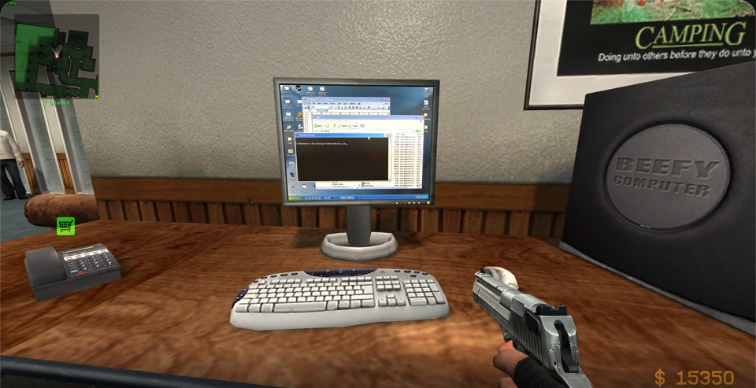
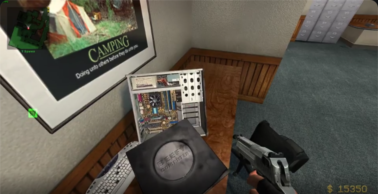
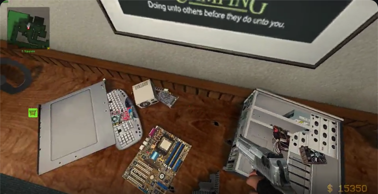

# Components of a Typical Desktop

## Case

Ah, the good old case. It used to have features like a 5.25" bay for floppy drives. Then, there were 3.5" bays for zip drives. Now, the front of the case is usually a glass panel for pretty points or a mesh panel for airflow. And otherwise, the cases are bogstandard pieces of Aluminium that are powder-coated and fit all the things y'could want. Standard fan mounts are 120mm and 140mm today and many cases have mounts for both.

## Motherboard

Here's a list of all the parts of a typical motherboard.

### Socket

The Motherboard Socket is where the CPU sits and depending on the configuration, it can have pins or pads in the CPU socket. If it has pins, there's usually an extra socket cover because it really needs it.

//TODO: Link PGA/LGA

### Headers

Headers are male connectors on a Motherboard that are used to connect all the interface from your other components to it. These include stuff like your case frontal I/O, fans, aRGB and more.

#### Fans

You can find at least two PWM 4-Pin headers on a normal motherboard, one for the CPU heatsink (aka cooler) fan, and the other for the case fan(s). On a not-bottom-of-the-barrell motherboard, you'll find one or two for CPU and three or more case fan headers. They're usually labelled with CPU_FAN and CHA_FAN. 

PWM stands for Pulse Width Modulation and with it, you can modulate a basic current in order to represent an analog signal that varies in strength. For this, the power flowing through the pin will be shut on and off, since it can either do 12V or no volts. Then, the average singal time on within a certain timeframe is used to determine the fan speed. For example, a 100% time on signal indicates the fan to operate at max speed, and a 50% time on signal indicates 50% fan speed.

The pins on a standard PWM connector are the following:
1. Ground
2. VCC (Power, usually +12V)
3. Sense/Tachometer
4. Control Input/PWM Signal

Sometimes You'll see CPU_OPT or a W_PUMP for a PWM pump, or CHA_FAN instead of SYS_FAN. There are no differences between these PWM connections, other than where they're situated, usually laid out for a semblance of cable management within the case.

Two- and Three-pin fans do not utilize a PWM signal to determine their speed, but rather sense the voltage that's being provided through the pins in order to regulate their fan speed. This is why, if you connect a 3-pin fan to a 4-pin header, which you can do, they will always run at 100%, because the voltage running through the power pin on a PWM signal is constant.

#### RGB

There are two different possible RGB headers on a motherboard, 12V 5-Pin and 5V offset 3-Pin.

//TODO

#### Case I/O

//TODO

Useful to know is that the layout is now standardized and that because of this, you can locate this group of pins on the motherboard and as long as the power supply is plugged in, you can operate the power button by shorting the PWR_BTN+ and PWR_BTN- pins on the motherboard with a conductive material, such as a scredriver. Or in my case, a spark plug with a nut welded to it that's actually a bottle opener. Suprisingly handy, that. Useful to know is also the location of the CLR_CMOS pins, in the event that you need to clear your BIOS to its defaults quickly and/or often. You can use these same pins to wire them to your front I/O reset button, which is rarely used anyway, and that way you can reset to BIOS defaults without having to even open up your side panel.

## CPU

## Cooling

### Air Cooling

### Water Cooling

## GPU

## Storage

## RAM

RAM, or Random Access Memory, is what holds your programs that are currently up and running. It is, in principle, blazingly fast, but relatively small storage. Where RAM needs nanoseconds to access, Storage such as an SSD needs miliseconds. The RAM used in Desktops is, however, volatile, meaning when no voltage is running through your RAM, data on it is lost. 

These are the types of RAM:
1. `SRAM`: Static RAM, can hold data without power, uses transistors to store data
2. `DRAM`: Dynamic RAM, loses data on power loss, uses capacitors to store data
3. `SDRAM`: Synchronous Dynamic RAM, practically deprecated
4. `VRAM`: Video RAM, dedicated RAM on Graphics Cards

In a typical home desktop, `DRAM` is what's slotted into a `DIMM` slot, utilizing the `DDR` standard.
- `DIMM`: Dual Inline Memory Module, the physical standard to interface with Motherboards
- `DDR`: Double Data Rate, doubling effective speed, as opposed to `SDR`, Single Data Rate

The confusing thing about marketing consumer DRAM is that it's labelled as "6000MHz DDR5", for example, when in reality, it's running at 3000MHz DDR, which would double it and making it 6000MT/s (Mega-transfers per second). Windows has recently switched to showing MT/s in Task Manager, but for the longest time it was technically wrong, which is the best kind of wrong.

## PSU

# All-in-Ones

# Obscure and Notable Computers

## Dell Dimension

Also known as the 'Beefy Computer' from Counter-Strike: Source, the Dell Dimension was otherwise a bogstandard Office PC that many people probably commited tax fraud on.

//TODO: specs

