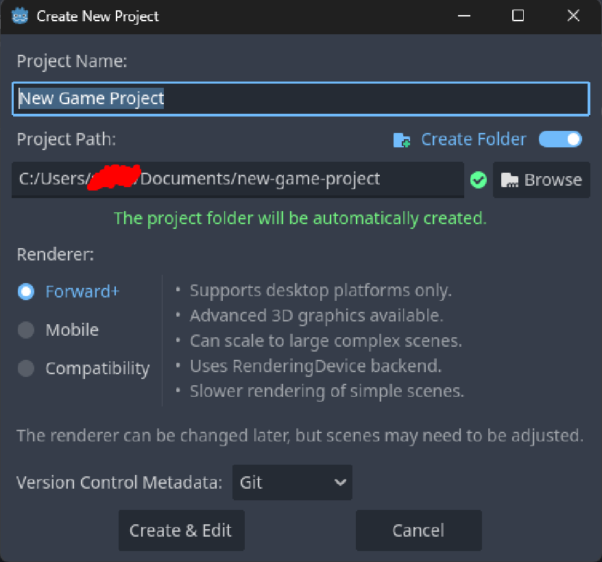

# Why Godot?

Godot is a fairly capable engine with support for C++, which I'm going to be using to build my games. There are possibilities of using GDScript, VisualScript or C#, but personally, I like control over a lot of the performance, hence I'm going to be using C++ with GDNative, which is their way of integrating C and C++ code into Godot projects.

# Setting up a project with C++

When setting up a Godot Project, you're asked to set a Project Name and Project Path. It's going to try to create it in your Documetns folder for windows, but I recommend setting up a separate folder somewhere else. The actual project folder will be named after your Project Name, as you can see.



I personally like creating a separate folder, then calling the Godot project by the build name. For example, instead of having

```C:/Repository/SnakeClone``` with Project Name 'SnakeClone', it'd be
```C:/Repository/SnakeClone/alpha``` with Project Name 'alpha'. Different build, different godot project.

Second, you're asked to choose a renderer. Given the following three options, these are the APIs they correspond to:

- `Forward+`: Vulkan
- `Mobile`: OpenGL ES 2.0 or 3.0
- `Compatibility`: OpenGL ES 2.0

Because I'm rooting for performance, Vulkan is my choice here.

Lastly, you're asked whether you want to have version control metadata. I'd recommend selecting `Git` if you use Git or otherwise don't know yet. It just makes life a bit easier down the road if you decide to track changes with Git.

Now, let's set up our devenv[^1] and get ready to write C++ in Godot. For that, I've listed an enumerated guide below to help make this as easy to look at as possible.

### 1: Install CMake & Compiler

To install `CMake`, head to [the CMake download page](https://cmake.org/download/?form=MG0AV3). Then, run `cmake --version` in a command prompt to make sure you have the version you want. I'll be working with `3.30.x`.

The compiler I've chosen to work with is `MinGW`, since it's optimized for windows. For linux, I'd recommend `GCC` and for MacOS, `Clang`. Installing MinGW goes as follows:

1. Download and install from [the official WinLibs website](https://winlibs.com/). WinLibs is the pre-made installation I'll be using. 

2. Add `mingw64/bin` (from wherever you've installed minGW to) to `PATH`[^2].

3. Verify installation by running `gcc --version` in a command prompt and making sure that it's working and it's the right version.

### 2: Install Godot headers

Clone the GitHub repository for `godot-cpp` into your top-level project folder, so that the `godot-cpp` folder lands in the same folder as your godot project. Look below for reference paths. If you are versioning your project using Git, it's a good idea to add them as Git submodules.[^3] The .gitignore[^4] files for Godot are already configured, so no need to create any by hand. 

You should now have a project folder that looks something like this:

```
SnakeClone/
    godot-cpp/
        (all the godot cpp dependencies)
    alpha/
        .godot/
            (bunch of godot files)
```

Now, let's create some headers.

### 3: Create Source files

//TODO

You should now have a project folder that looks something like this:

```
SnakeClone/
    godot-cpp/
        (all the godot cpp dependencies)
    alpha/
        .godot/
            (bunch of godot files)
    src/
        SnakeClone.h
        SnakeClone.cpp
```

### 4: Link C++ to Godot via GDExtension

Note: the `GDExtension` system replaces the `GDNative` implementation of earlier versions (pre 4.0).

//TODO

[^1]: devenv: short for 'development environment', used to describe the suite of tools, such as a text editor, compiler, linker, etc. that are made use of to build a project. The digital equivalent of an office desk.

[^2]: adding something to `PATH` on windows, see [why and how](https://www.eukhost.com/kb/how-to-add-to-the-path-on-windows-10-and-windows-11/).

[^3]: To do so, you'll need to run `git init` and `git submodule add https://github.com/godotengine/godot-cpp`. If you cloned into the project folder manually, run `git submodule update --init --recursive` after having done so. For more info, [read here](https://docs.godotengine.org/en/3.5/tutorials/scripting/gdnative/gdnative_cpp_example.html).

[^4]: a `.gitignore` file is exactly what it sounds like, it's a list of paths that should be ignored by git. Specify here which files should not have changes to them tracked and/or uploaded to github alongside your project folder.