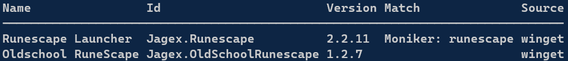

## Automation before PowerShell

There are some neat little things you can do to start automating parts of your workflow, even before touching powershell. 

### Package managers

For instance, updating/installing/uninstalling apps with [package managers](), like [winget](https://learn.microsoft.com/en-us/windows/package-manager/winget/) or [scoop](https://scoop.sh/). Winget is installed on your windows machine by default, and if you use linux, you don't need me to tell you about package managers. 
All of the following commands require a Windows Terminal, CMD or PowerShell window. (I'd reccomend setting up a personal terminal[^1])
```winget upgrade``` will show and perform updates from packages that are registered, these include apps from the microsoft store. If you know the name of a package, which is usually ```dev.app``` (or ```app.app``` for some reason), you can install it right away with ```winget install <packagename>```, but if you don't, just hit the good ol' ```winget search```. There are lots more packages than you might expect, for example, ```winget search runescape``` returns:



But we all know you prefer RuneLite.

Winget isn't the best user experience since it often relies on the msstore versions of apps (which are sometimes truly terrible) so, when you're not installing a native msstore app or a microsoft product, use scoop, instead.

Regardless, getting used to package managers is a good way to reduce the amount of time it takes for you to update/install/uninstall things. You'll also get more comfortable using the CLI.

### 

# Getting started in PowerShell

[Corresponding Microsoft Learning Module](https://learn.microsoft.com/en-us/training/modules/introduction-to-powershell/)

Powershell is fairly simple if you've written code before, but if you haven't, don't be alarmed. Let's first look at how you'd write a simple "Hello, World".
For this, create a ```test.ps1``` with the following content:
```
Write-Host "Hello, World"
```
You can then just run it. Actually, I recommend making a ```scripts``` folder somewhere and then [adding that folder to the PATH](https://stackoverflow.com/questions/44272416/how-to-add-a-folder-to-path-environment-variable-in-windows-10-with-screensho). You can now run it from anywhere, by just writing ```test``` in a shell.

Let's store something in a variable, for which we use ```$```:
```
$name = "Mandi"
Write-Host "Hello, I'm $name."
```
Output: ```Hello, I'm Mandi.```

We can use simple, built-in functions like ```Get-Date```:
```
$date = Get-Date
Write-Host "Today's date is $date."
```
Output: ```Today's date is 05/26/2024 20:42:59.```

Ain't pretty, is it. But, we can use flags for the Get-Date cmdlet like follows:
```
$day = Get-Date -Format "dddd"
$date = Get-Date -Format "dd"
$month = Get-Date -Format "MMMM"
$year = Get-Date -Format "yyyy"

Write-Host "Today's $day, the $date of $month $year."
```
Output: ```Today's Sunday, the 26 of May 2024.```

Here, the -Format flag takes a string and reads just that, how to format Get-Date. The main takeaway here are flags, how to use them, and the fact that variables get processed within a string[^2].

## Automating Simple Tasks in PowerShell

Example Application: [Automated, compressed backup using WinRAR](https://github.com/FlyMandi/FlyMandi/blob/main/10%20-%20Automation/xample_backup.ps1)

//TODO  

[^1]: Using the Windows Terminal app is a great idea. It's a lot like a linux bash. It's like a modern combination of cmd & PowerShell. Install it by running ```winget install Microsoft.WindowsTerminal``` and you can read up on cool extra customization [here](https://dev.to/ansonh/customize-beautify-your-windows-terminal-2022-edition-541l) and [here](https://learn.microsoft.com/en-us/windows/terminal/tutorials/custom-prompt-setup).

[^2]: If you wanted to output the string "I make $$$", you'd have to put a backtick in front of every dollar sign.